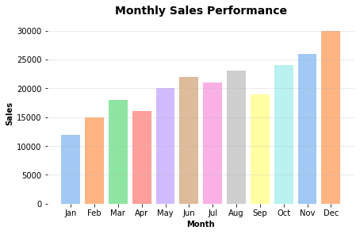
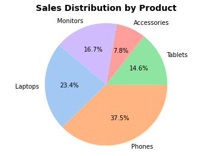
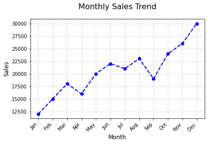
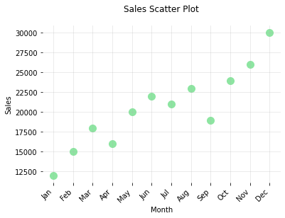

# Python Charts

## Bar Charts
Bar charts are ideal for comparing values across categories, such as sales by region or product type. It clearly shows differences
between groups, making it useful for visualizing rankings, distributions, or changes over time with discrete data.



## Pie Charts
A pie charts are ideal for showing how parts make up a whole. It's best used with a small number of categories to display percentage or proportional data, such as market share or budget breakdowns, where the total equals 100%.



## Line Charts
A line chart is ideal for showing trends over time or continuous data. It helps visualize patterns, increases, or decreases across
time intervals, such as monthly sales, temperature changes, or stock prices. It's best when the data points are connected sequentially.



## Scatter Plot Charts
Scatter plots charts are ideal for showing relationships or correlations between two numeric variables. They help identify patterns, trends, clusters, or outliers, such as height vs. weight or sales vs. advertising spend, making them perfect for exploring data distributions and dependencies.




## Features
- **Automated Data Loading**: Reads sales data from a structured CSV file
- **Chronological Ordering**: Ensures months are displayed in correct calendar order
- **Color-Coded Visualization**: Uses a blue gradient to represent sales magnitude
- **Clean Design**: Includes gridlines, labels, and professional styling
- **Error Handling**: Validates file existence before processing


## Requirements
```txt
pandas
seaborn
matplotlib
pathlib
```


## Project Structure
```
project/
│
├── data/
│   └── sales_data.csv    # Sales data file
│
├── barchart.py         # barchart script
├── linechart.py        # linechart script
├── piechart.py         # piechart script
├── scatterplotchart.py # scatterplotchart script
└── README.md     # This file
```